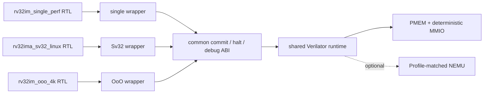
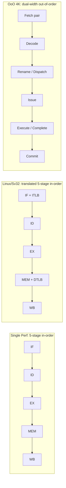

# NPC RISC-V multi-profile processors

[中文](README.md)

This repository contains three independently locked RISC-V RTL source sets and
one shared, command-line Verilator environment. The default Profile is
`rv32im_ooo_4k`. NVBoard, display, keyboard, and other board UI components are
not required.

The three RTL sets are not one parameterized implementation. Each build selects
one source set and connects it through a Profile-specific headless wrapper to a
common memory/runtime, commit-packet ABI, and optional NEMU difftest interface.

## Three Profiles

| Profile | ISA / privilege | Microarchitecture | Memory and prediction structures | Primary use |
| --- | --- | --- | --- | --- |
| `rv32im_single_perf` | RV32IM / M | 5-stage, single issue and commit | 4 KiB 2-way I/D caches; 128-entry BTB/PHT | Bare-metal performance and in-order pipeline study |
| `rv32ima_sv32_linux` | RV32IMA / M+S, Sv32 | 5-stage, single issue and commit | 4 KiB 2-way I/D caches; 16-entry ITLB/DTLB; 2-entry store buffer; ACLINT | OpenSBI, virtual memory, and system-software integration |
| `rv32im_ooo_4k` | RV32IM / M | Dual dispatch/issue/complete/commit OoO; 64 PRF, ROB8, IQ8, 2 checkpoints | 4 KiB instruction-pair storage; 4 KiB physically tagged word cache | Dual-width out-of-order throughput study |

The OoO instruction-pair storage is a 64-bit pair-oriented frontend structure,
not a conventional set-associative I-cache. See [Architecture](docs/architecture.en.md)
for the detailed comparison.



## Pipeline concepts



## Current performance

CoreMark uses a fixed AM/CoreMark commit, `ITERATIONS=10`, one context, and
hash-locked M-mode/Sv32 binaries. `timed CPI` covers only the retirement marker
interval; `whole CPI` also includes startup, MMIO output, and termination.
`CoreMark/MHz` is iterations per million simulated cycles. It needs no clock
assumption and is not an absolute CoreMark score.

| Profile | CoreMark timed CPI | CoreMark/MHz | Whole-program CPI | Evidence state |
| --- | ---: | ---: | ---: | --- |
| `rv32im_single_perf` | 1.484920431 | 2.201416876 | 1.485861312 | `verified`, NEMU difftest PASS |
| `rv32ima_sv32_linux` | 1.725375105 | 1.894598197 | 1.725944902 | `verified`, private/public timed interval identical, NEMU difftest PASS |
| `rv32im_ooo_4k` | 0.879973757 | 3.714802709 | 0.882383851 | `provisional`, self-check PASS; dual-retire MMIO difftest ambiguity unresolved |

No closed frequency, area, power, or silicon data is currently available. The
absolute CoreMark score also remains `—`. Binary/config hashes, counter
partitions, and commands are in [Performance](docs/performance.en.md) and the
[CoreMark evidence](docs/evidence/coremark_reproduction.en.md).

The OoO Profile also has one historical **instruction-weighted seven-workload
aggregate CPI**:

```text
aggregate CPI = sum(workload cycles) / sum(workload retired instructions)
              = 5,157,299 / 5,649,752
              = 0.912836351
```

The set is CoreMark, matrix-mul, crc32, quick-sort, load-store, Dhrystone, and
microbench. This is neither the arithmetic mean of seven CPI values nor a
CoreMark score. The complete external input set has not yet been rerun through
the current public flow, so this row remains `provisional`.

## Quick start

Python 3.8+, GNU Make, PyYAML, and Verilator 5.x are required:

```sh
python3 -m pip install --user PyYAML
make defconfig
make showconfig
make config-check source-check docs-check public-hygiene
make verilator-lint
make smoke
```

Regenerate `.config` when selecting another Profile:

```sh
make rv32im_single_perf_defconfig
make rv32ima_sv32_linux_defconfig
make rv32im_ooo_4k_defconfig
```

Run a user-supplied image with:

```sh
NPC_OPEN_IMAGE=/path/to/program.bin make sim
```

NEMU is disabled by default. A strict local run can prepare a reference adapter
matching the selected Profile:

```sh
make difftest-prepare NPC_NEMU_SOURCE_REPO=/path/to/ysyx-workbench
make difftest
```

CoreMark binaries and ELFs are not tracked. After obtaining inputs matching the
manifest hashes, run:

```sh
NPC_OPEN_COREMARK_IMAGE=/path/to/coremark.bin \
NPC_OPEN_COREMARK_ELF=/path/to/coremark.elf \
make coremark
```

## SoC and verification boundary

| Capability | Current state |
| --- | --- |
| Sparse PMEM, Legacy RTC/serial, AXI Timer, UARTLite | Verilator `runtime-only` |
| Linux ACLINT `mtime/mtimecmp` | Linux Profile `RTL-integrated` |
| AXI INTC | NEMU/AM `reference-only` |
| Profile source closure, lint, bounded smoke/regression | `verified` |
| Complete Linux kernel boot | `not_claimed` |
| ASIC/PPA, FPGA, and silicon results | `not_claimed` |

Continue with [Simulation](docs/simulation.en.md),
[Verification](docs/verification.en.md), [SoC integration](docs/soc-integration.en.md),
[Limitations](docs/limitations.en.md), and the [documentation index](docs/README.en.md).
NEMU, AM, OpenSBI, Linux, PDKs, standard-cell libraries, SRAM macros, EDA
databases, and board projects are not bundled; each external component retains
its own license.
