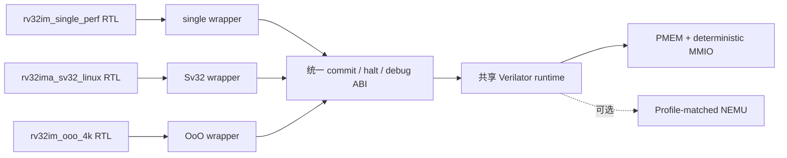

# NPC RISC-V 多 Profile 处理器

[English](README.en.md)

本仓库包含三套面向不同目标、独立冻结的 RISC-V RTL，以及一套共享的纯
Verilator 命令行仿真环境。默认 Profile 是 `rv32im_ooo_4k`。工程不依赖
NVBoard、显示、键盘或其他板级界面。

三套 RTL 不是同一份参数化实现。每次构建只选择一个 source set，并通过该
Profile 的 headless wrapper 接入统一的 memory/runtime、commit packet 和可选
NEMU difftest 接口。

## 三个 Profile

| Profile | ISA / 特权级 | 微架构 | 存储与预测结构 | 主要用途 |
| --- | --- | --- | --- | --- |
| `rv32im_single_perf` | RV32IM / M | 5 级、单发射、单退休 | 4 KiB 两路 I/D cache；128-entry BTB/PHT | 裸机性能与顺序流水线研究 |
| `rv32ima_sv32_linux` | RV32IMA / M+S、Sv32 | 5 级、单发射、单退休 | 4 KiB 两路 I/D cache；16-entry ITLB/DTLB；2-entry store buffer；ACLINT | OpenSBI、虚拟内存与系统软件集成 |
| `rv32im_ooo_4k` | RV32IM / M | 双 dispatch/issue/complete/commit OoO；64 PRF、ROB8、IQ8、2 checkpoints | 4 KiB instruction-pair storage；4 KiB physically-tagged word cache | 双宽乱序吞吐研究 |

OoO 的 instruction-pair storage 是面向 64-bit 指令对的前端结构，不是传统
组相联 I-cache。完整对比见[架构说明](docs/architecture.md)。



## 流水线概念图

```mermaid
flowchart LR
  subgraph P1["Single Perf: 5-stage in-order"]
    direction LR
    A1["IF"] --> A2["ID"] --> A3["EX"] --> A4["MEM"] --> A5["WB"]
  end
  subgraph P2["Linux/Sv32: translated 5-stage in-order"]
    direction LR
    B1["IF + ITLB"] --> B2["ID"] --> B3["EX"] --> B4["MEM + DTLB"] --> B5["WB"]
  end
  subgraph P3["OoO 4K: dual-width out-of-order"]
    direction LR
    C1["Fetch pair"] --> C2["Decode"] --> C3["Rename / Dispatch"] --> C4["Issue"] --> C5["Execute / Complete"] --> C6["Commit"]
  end
  A5 ~~~ B1
  B5 ~~~ C1
```



## 当前性能

CoreMark 使用固定 AM/CoreMark commit、`ITERATIONS=10`、单 context 和
hash-locked M-mode/Sv32 binary。`timed CPI` 只覆盖退休 start/stop marker 之间；
`whole CPI` 包含启动、MMIO 输出和结束。`CoreMark/MHz` 是每百万仿真周期完成的
iteration 数，不需要假设时钟频率，也不是绝对 CoreMark score。

| Profile | CoreMark timed CPI | CoreMark/MHz | Whole-program CPI | 证据状态 |
| --- | ---: | ---: | ---: | --- |
| `rv32im_single_perf` | 1.484920431 | 2.201416876 | 1.485861312 | `verified`，NEMU difftest PASS |
| `rv32ima_sv32_linux` | 1.725375105 | 1.894598197 | 1.725944902 | `verified`，私有/公开 timed 区间完全一致，NEMU difftest PASS |
| `rv32im_ooo_4k` | 0.879973757 | 3.714802709 | 0.882383851 | `provisional`，self-check PASS；双退休 MMIO difftest 歧义未解除 |

当前没有闭合频率、面积、功耗或硅后数据。绝对 CoreMark score 也保持 `—`。
精确 binary/config hash、计数分区和复现命令见[性能页](docs/performance.md)与
[CoreMark 证据](docs/evidence/coremark_reproduction.md)。

OoO 另有一组历史的**七项工作负载指令加权聚合 CPI**：

```text
aggregate CPI = sum(workload cycles) / sum(workload retired instructions)
              = 5,157,299 / 5,649,752
              = 0.912836351
```

七项为 CoreMark、matrix-mul、crc32、quick-sort、load-store、Dhrystone 和
microbench。它不是七个 CPI 的算术平均，也不是 CoreMark score；该组外部输入
尚未在当前公开流程完整复跑，因此状态为 `provisional`。

## 快速开始

需要 Python 3.8+、GNU Make、PyYAML 和 Verilator 5.x：

```sh
python3 -m pip install --user PyYAML
make defconfig
make showconfig
make config-check source-check docs-check public-hygiene
make verilator-lint
make smoke
```

切换 Profile 时重新生成 `.config`：

```sh
make rv32im_single_perf_defconfig
make rv32ima_sv32_linux_defconfig
make rv32im_ooo_4k_defconfig
```

运行自备程序镜像：

```sh
NPC_OPEN_IMAGE=/path/to/program.bin make sim
```

默认不启用 NEMU。严格测试可在本机准备与 Profile 匹配的 reference adapter：

```sh
make difftest-prepare NPC_NEMU_SOURCE_REPO=/path/to/ysyx-workbench
make difftest
```

CoreMark binary 和 ELF 不进入 Git；取得与 manifest hash 一致的输入后运行：

```sh
NPC_OPEN_COREMARK_IMAGE=/path/to/coremark.bin \
NPC_OPEN_COREMARK_ELF=/path/to/coremark.elf \
make coremark
```

## SoC 与验证边界

| 能力 | 当前状态 |
| --- | --- |
| Sparse PMEM、Legacy RTC/serial、AXI Timer、UARTLite | Verilator `runtime-only` |
| Linux ACLINT `mtime/mtimecmp` | Linux Profile `RTL-integrated` |
| AXI INTC | NEMU/AM `reference-only` |
| Profile source closure、lint、bounded smoke/regression | `verified` |
| 完整 Linux kernel 启动 | `not_claimed` |
| ASIC/PPA、FPGA、硅后结果 | `not_claimed` |

进一步阅读：[仿真指南](docs/simulation.md)、[验证说明](docs/verification.md)、
[SoC 集成](docs/soc-integration.md)、[限制说明](docs/limitations.md)和
[文档索引](docs/README.md)。NEMU、AM、OpenSBI、Linux、PDK、标准单元库、
SRAM macro、EDA 数据库和板级工程均不随仓库提供；各外部组件遵循其自身许可。
