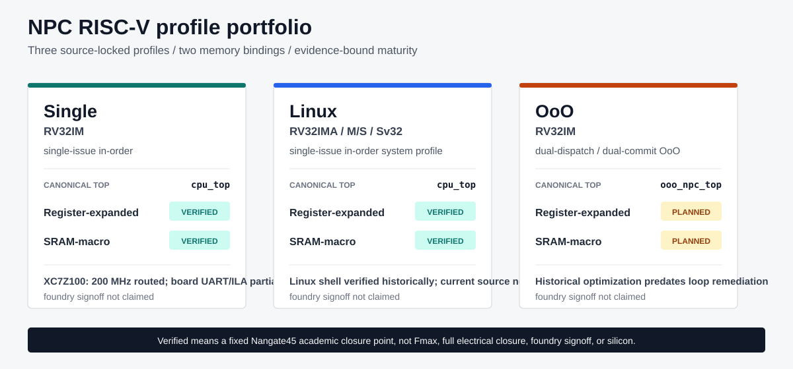
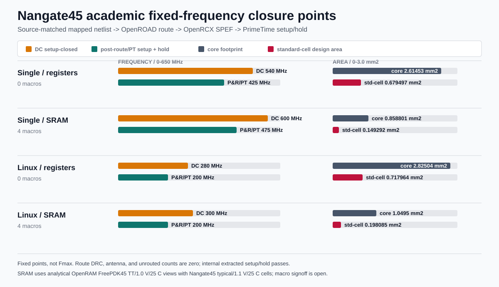

# NPC RISC-V 三 Profile 处理器

[](https://github.com/ichigo-6301/npc-riscv-open/actions/workflows/public-ci.yml)  [](LICENSE)

[English](README.en.md) · [架构](docs/architecture.md) · [性能](docs/performance.md) · [验证](docs/verification.md) · [ASIC](docs/asic-implementation.md) · [限制](docs/limitations.md) · [Roadmap](docs/roadmap.md)

**一个覆盖裸机性能、Sv32/Linux 系统能力与双宽乱序研究的多 Profile RV32 CPU 项目，并公开可复查的仿真合同与 Nangate45 academic ASIC 后端证据。**

三套 Profile 是独立 source lock，不是同一份参数化 RTL。默认旗舰与 quickstart 仍是正在优化的 `rv32im_ooo_4k`；已完成后端审计的是单发射 `rv32im_single_perf` 和 Linux/Sv32 `rv32ima_sv32_linux`。默认公开仿真入口为 [`npc_public_sim_top`](rtl/wrappers/rv32im_ooo_4k_sim_top.sv) + [`filelists/rv32im_ooo_4k.f`](filelists/rv32im_ooo_4k.f)，运行 `make defconfig && make smoke` 可得到有界 PASS 结果。



## 60 秒状态矩阵

<!-- evidence:single_linux_nangate45_backend_public -->
<!-- nonclaim:ooo_ppa_timing_not_claimed -->

| Profile | ISA / 微架构 | 公开 RTL 与 runtime | Register-expanded 后端 | SRAM-macro 后端 |
| --- | --- | --- | --- | --- |
| `rv32im_single_perf` | RV32IM，5 级单发射顺序流水线 | 当前仿真/ASIC 已验证；历史 XC7Z100 200 MHz implementation 已验证，UART/ILA 板级观测为 `partial` | `verified` fixed point | `verified` fixed point |
| `rv32ima_sv32_linux` | RV32IMA，M/S + Sv32，单发射 | 当前 bounded 回归已验证；`e3a1cc91` 历史 OpenSBI→S-mode→Linux shell 已验证，`0fc3de40` 尚未深跑复验 | `verified` fixed point | `verified` fixed point |
| `rv32im_ooo_4k` | RV32IM，双 dispatch/issue/complete/commit OoO | 默认旗舰；RTL 与公开 runtime 可运行，性能 claim 仍为 `provisional` | `planned / TODO` | `planned / TODO` |

`verified` 在这里仅表示固定频率的 Nangate45 academic physical implementation 与 internal extracted setup/hold STA。它不表示 Fmax、完整 IO/电气闭合、foundry signoff 或 silicon result。

## 已验证结果

### Nangate45 固定频率闭合点



<!-- claim:single_registers_nangate45_dc_frequency maturity:verified -->
<!-- claim:single_registers_nangate45_postroute_frequency maturity:verified -->
<!-- claim:single_registers_nangate45_standard_cell_area maturity:verified -->
<!-- claim:single_registers_nangate45_core_area maturity:verified -->
<!-- claim:single_sram_nangate45_dc_frequency maturity:verified -->
<!-- claim:single_sram_nangate45_postroute_frequency maturity:verified -->
<!-- claim:single_sram_nangate45_standard_cell_area maturity:verified -->
<!-- claim:single_sram_nangate45_core_area maturity:verified -->
<!-- claim:linux_registers_nangate45_dc_frequency maturity:verified -->
<!-- claim:linux_registers_nangate45_postroute_frequency maturity:verified -->
<!-- claim:linux_registers_nangate45_standard_cell_area maturity:verified -->
<!-- claim:linux_registers_nangate45_core_area maturity:verified -->
<!-- claim:linux_sram_nangate45_dc_frequency maturity:verified -->
<!-- claim:linux_sram_nangate45_postroute_frequency maturity:verified -->
<!-- claim:linux_sram_nangate45_standard_cell_area maturity:verified -->
<!-- claim:linux_sram_nangate45_core_area maturity:verified -->
<!-- evidence:single_linux_nangate45_backend_public -->

| 路线 | DC / route+PT | PT setup / hold WNS | Standard-cell / core footprint | Macro |
| --- | ---: | ---: | ---: | ---: |
| Single / registers | 540 / 425 MHz | +0.025646 / +0.063219 ns | 0.679497 / 2.614530 mm² | 0 |
| Single / SRAM | 600 / 475 MHz | +0.013556 / +0.047904 ns | 0.149292 / 0.858801 mm² | 4 |
| Linux / registers | 280 / 200 MHz | +0.387809 / +0.032648 ns | 0.717964 / 2.825040 mm² | 0 |
| Linux / SRAM | 300 / 200 MHz | +0.720415 / +0.039090 ns | 0.198085 / 1.049500 mm² | 4 |

四条路线均完成 placement、CTS、detail route、GDS、OpenRCX 和 PrimeTime，detail-route DRC / antenna / unrouted 均为 `0 / 0 / 0`。mapped netlist、P&R import、routed netlist/SDC、SPEF 与 Liberty/DB 的角色级 SHA256 和 same-run identity 见[后端证据说明](docs/evidence/backend_closure.md)与[机器可读证据](evidence/implementation/nangate45_fixed_points.json)。

SRAM 行使用 OpenRAM analytical FreePDK45 TT / 1.0 V / 25 C macro view 与 Nangate45 typical / 1.1 V / 25 C standard-cell view，保留 RC-004；macro DRC/LVS/PEX、OCV/MMMC、DFT、LEC、power/PI 尚未闭合。寄存器与 SRAM 行代表不同 memory binding，不能把面积差直接解释为完整芯片 PPA 改善。

### 仿真性能

<!-- claim:single_public_coremark_timed_cpi maturity:verified -->
<!-- claim:single_public_coremark_per_mhz maturity:verified -->
<!-- claim:single_public_coremark_whole_cpi maturity:verified -->
<!-- evidence:coremark_public_current -->
<!-- nonclaim:ooo_public_coremark_runtime_provisional -->

| Profile | CoreMark timed CPI | CoreMark/MHz | Whole-program CPI | 边界 |
| --- | ---: | ---: | ---: | --- |
| `rv32im_single_perf` | 1.484920431 | 2.201416876 | 1.485861312 | `verified`，固定 binary/config，NEMU difftest PASS |
| `rv32ima_sv32_linux` | 1.725375105 | 1.894598197 | 1.725944902 | `historical_verified` 于 `abf66cad`；`0fc3de40` source lock 尚待同输入复测 |
| `rv32im_ooo_4k` | 0.879973757 | 3.714802709 | 0.882383851 | `provisional`，self-check PASS；双退休 MMIO difftest 顺序仍未消歧 |

`CoreMark/MHz` 是固定 marker 区间内每百万仿真周期完成的 iteration 数，不是绝对 CoreMark score，也不假设已实现时钟。完整计数、binary/config hash 与复现合同见[性能页](docs/performance.md)和[CoreMark 证据](docs/evidence/coremark_reproduction.md)。

### 系统与历史 FPGA 证据

<!-- evidence:linux_coremark_history_public -->
<!-- evidence:linux_boot_history_public -->
<!-- evidence:ooo_historical_optimization_public -->
<!-- evidence:single_xc7z100_history_public -->

| 路径 | 已记录结果 | 成熟度边界 |
| --- | --- | --- |
| Linux/Sv32 优化 | historical whole CPI `8.587098694 → 1.725944902`，同 benchmark family 约 `4.9753x` | comparison `partial`；当前 `0fc3de40` 未按同输入复跑 |
| Linux 系统启动 | DTB→OpenSBI→S-mode→Linux 6.6.141→initramfs shell | `verified` 于历史 `e3a1cc91` |
| OoO 前端/预测 | frontend-empty `53.76%→23.29%`，redirect/control completion `59.38%→17.73%` | 历史 seven-workload、组合环整改前；当前性能不继承 |
| XC7Z100 | 三个历史快照均完成 200 MHz routed timing；早期快照有 UART/ILA CoreMark 观测 | implementation/timing `verified`；board/workload binding `partial`；后续 Forwarding/BTB-PHT 未上板声明 |

计算公式、source ref、报告 hash 与非声明边界见[历史性能证据](docs/evidence/performance_history.md)和[系统/FPGA 证据](docs/evidence/system_fpga_history.md)。

## Canonical top 与 filelist

每次构建只选择一套 source set。三个 wrapper 都提供相同名称的 `npc_public_sim_top`，但只能与同一行的 filelist 配对。

| Profile | Native top | Public wrapper / filelist | Defconfig |
| --- | --- | --- | --- |
| Single | [`cpu_top`](rtl/profiles/rv32im_single_perf/cpu_top.v) | [`rv32im_single_perf_sim_top.sv`](rtl/wrappers/rv32im_single_perf_sim_top.sv) / [`rv32im_single_perf.f`](filelists/rv32im_single_perf.f) | `rv32im_single_perf_defconfig` |
| Linux/Sv32 | [`cpu_top`](rtl/profiles/rv32ima_sv32_linux/top/cpu_top.v) | [`rv32ima_sv32_linux_sim_top.sv`](rtl/wrappers/rv32ima_sv32_linux_sim_top.sv) / [`rv32ima_sv32_linux.f`](filelists/rv32ima_sv32_linux.f) | `rv32ima_sv32_linux_defconfig` |
| OoO（默认） | [`ooo_npc_top`](rtl/profiles/rv32im_ooo_4k/top/ooo_npc_top.sv) | [`rv32im_ooo_4k_sim_top.sv`](rtl/wrappers/rv32im_ooo_4k_sim_top.sv) / [`rv32im_ooo_4k.f`](filelists/rv32im_ooo_4k.f) | `rv32im_ooo_4k_defconfig` |

SoC 接口、MMIO、commit packet 与 wrapper 选择见[集成说明](docs/soc-integration.md)。

## 快速开始

依赖为 Python 3.8+、GNU Make、PyYAML 和 Verilator 5.x。下面保持 OoO 为默认 Profile，并产生可见的 `SMOKE_PASS`：

```bash
python3 -m pip install --user PyYAML
make defconfig
make showconfig
make config-check source-check showcase-check public-hygiene
make verilator-lint
make smoke
```

切换 Profile 后重新生成 `.config`：

```bash
make rv32im_single_perf_defconfig
make rv32ima_sv32_linux_defconfig
make rv32im_ooo_4k_defconfig
```

不安装商业 EDA 也可以检查四个公开 ASIC 合同；dry-run 只打印经过校验的阶段命令，不伪装工具执行：

```bash
make rv32im_single_perf_sram_asic_defconfig
make asic-config-check
make lc-macros-dry-run
make dc-matrix-dry-run
make pnr-dry-run
make sta-dry-run
```

真实 EDA 运行需要用户自备工具、PDK/library/macro views 和 ignored 本地配置。公开仓库不包含 raw report、mapped/routed netlist、SPEF、GDS、Liberty/DB/LEF、license 或私有主机信息。

## 文档导航

[三 Profile 架构](docs/architecture.md) · [仿真与 difftest](docs/simulation.md) · [性能与实现数据](docs/performance.md) · [历史性能证据](docs/evidence/performance_history.md) · [系统/FPGA 证据](docs/evidence/system_fpga_history.md) · [验证矩阵](docs/verification.md) · [ASIC 流程合同](docs/asic-implementation.md) · [后端证据](docs/evidence/backend_closure.md) · [完整限制](docs/limitations.md) · [后续路线](docs/roadmap.md) · [文档索引](docs/README.md)

## 限制与后续

历史 Linux boot 和 XC7Z100 implementation/board observation 已按 source snapshot 分层公开；当前 Linux source 的深跑复验、当前 Single source 的重新上板、coverage closure 和 silicon 结果仍不声明。Single/Linux 后续工作集中在 source-matched 系统复验、外部 IO、电气例外、SRAM characterization 与 macro signoff；OoO 当前继续做无环 RTL 优化，其 register/SRAM 综合与后端流程保持 `planned/TODO`。
